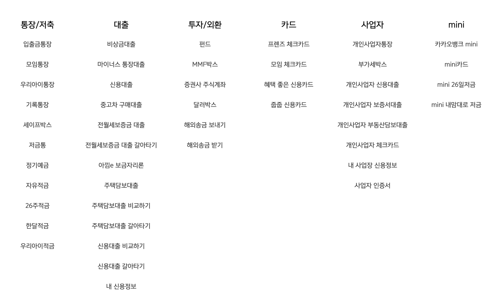
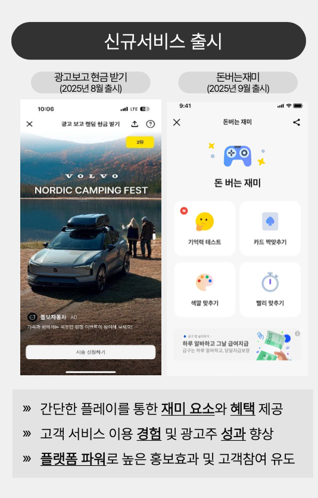
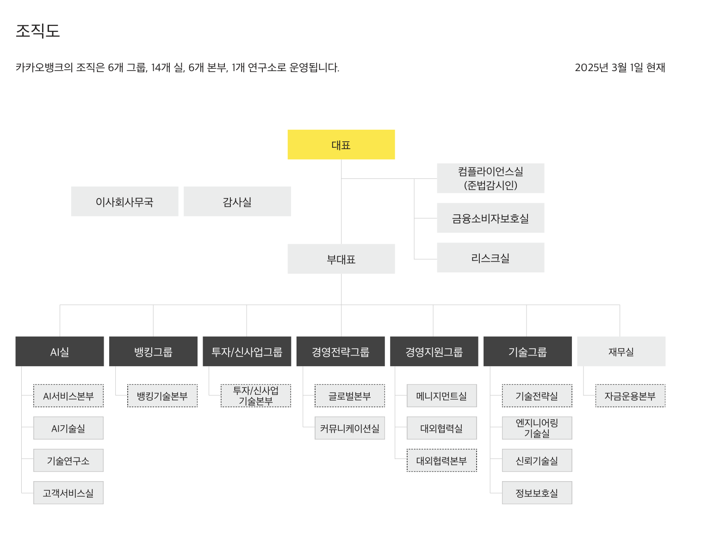
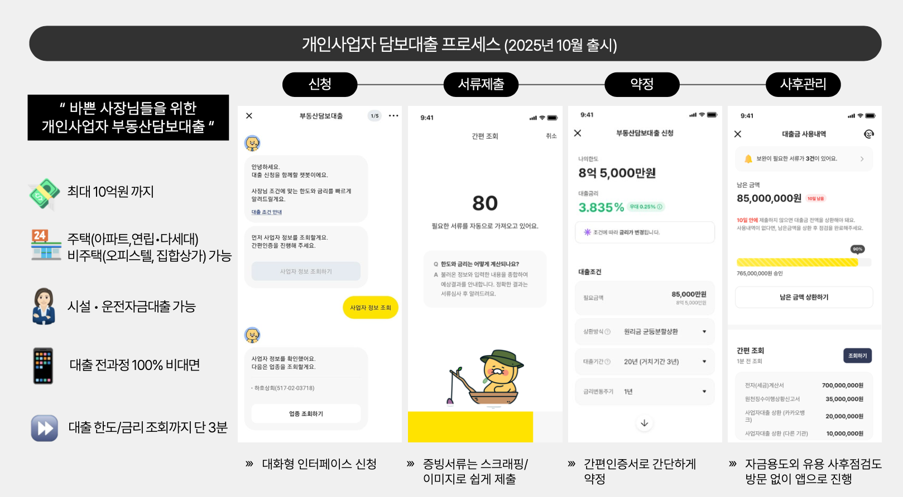
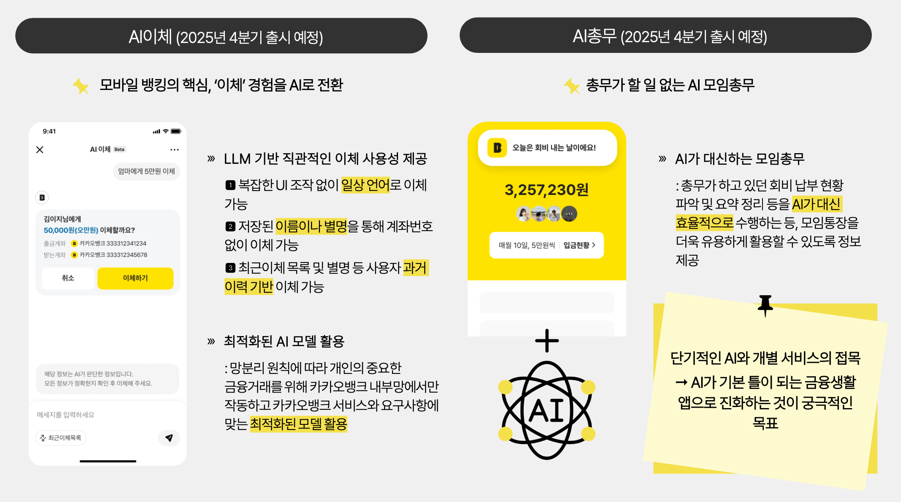
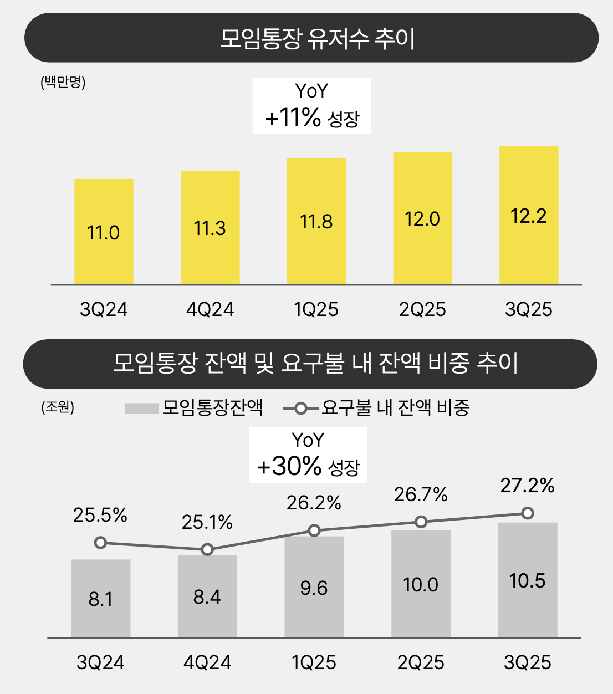

# 목차

- [토스뱅크](#토스뱅크)
  - [1. 어떤 비전을 가지고 있나요?](#1-어떤-비전을-가지고-있나요)
  - [2. 어떤 방식으로 일을 하나요?](#2-어떤-방식으로-일을-하나요)
  - [3. 어떤 서비스를 운영하고 있나요?](#3-어떤-서비스를-운영하고-있나요)
  - [4. 각 서비스의 조직도를 직접 예측해 보세요.](#4-각-서비스의-조직도를-직접-예측해-보세요)
  - [기타. 토스 - 토스뱅크 지배구조](#기타-토스---토스뱅크-지배구조)
  - [참고자료](#참고자료)
- [카카오뱅크](#카카오뱅크)
  - [1. 어떤 비전을 가지고 있나요?](#1-어떤-비전을-가지고-있나요-1)
  - [2. 어떤 방식으로 일을 하나요?](#2-어떤-방식으로-일을-하나요-1)
  - [3. 어떤 서비스를 운영하고 있나요?](#3-어떤-서비스를-운영하고-있나요-1)
  - [4. 각 서비스의 조직도를 직접 예측해 보세요.](#4-각-서비스의-조직도를-직접-예측해-보세요-1)
  - [기타 - 주요 사업 전략 및 재무 분석](#기타---주요-사업-전략-및-재무-분석)
  - [참고자료](#참고자료-1)

---

# 토스뱅크

## 1. 어떤 비전을 가지고 있나요?

`핵심`: 새롭고 고객 지향적인 은행을 통한 혁신 (`출범`: 2021.10.05 (국내 20번째 은행)

- 토스 커뮤니티의 [핵심 가치 3.1](https://toss.oopy.io/a201e419-e243-4401-983f-1ac3cad02900)을 바탕으로 아래 미션과 목표를 지향한다.
- 미션
    - 이전으로 돌아갈 수 없는 새로운 은행 경험 제공
- 목표
    - 금융 서비스의 중심을 ‘공급자’에서 ‘사용자 중심’으로 이동
    - 고객 범위 확장 -> 직장인, 소상공인, 저신용자
    - 당연하게 여겨졌던 불편함들을 하나씩 개선

## 2. 어떤 방식으로 일을 하나요?

- 핵심 전략
    - `PO`: 가장 단순하지만, 가장 큰 혜택을 주는 제품을 만드는 데 집중한다.
    - `Tech`: 비즈니스에 임팩트를 주는 기술을 도입하고, 대한민국 금융 IT 수준을 상향 평준화한다.
- 일하는 과정
    - 금융 서비스의 접근성과 포용성을 넓히는 데 집중한다.
    - 빠른 실행과 주기적인 회고를 통해 혁신을 추구하되, 은행으로서의 `안정성`과 `정합성`을 놓치지 않는다.
- 조직 문화
    - `신뢰와 자율`: 누구나 문제 해결의 주체가 되는 신뢰 기반의 문화 속에서 일한다.
    - `DRI` (최종 의사결정권자): 적극적인 의지를 가진 사람이 자신만의 권한과 책임을 가지고 일한다.
    - `본질과 몰입`: 불필요한 절차 대신 일의 본질에 집중하여 제품에 큰 임팩트를 만든다.

## 3. 어떤 서비스를 운영하고 있나요?

### 통장

### 예적금/목돈 굴리기

### 대출/갈아타기

### 신용카드/체크카드/서비스

## 4. 각 서비스의 조직도를 직접 예측해 보세요.

### 전체

> 2025.03.20 기준

- 여러 직무가 모인 곳 - 스쿼드
- 같은 직무가 모인 곳 - 챕터

### 세부

> 아래는 [토스뱅크 채용 공고](https://toss.im/career/community/tossbank)를 바탕으로 
> [Server Developer](https://toss.im/career/job-detail?job_id=4071141003&sub_position_id=4076109003&company=토스뱅크) 중심으로 작성했으며, 일부는 생략했습니다.

- Engineering
    - **Server Developer** (주요 기술 스택: Kotlin, Spring, MySQL, Redis, Kafka, Prometheus, Grafana)
        - Product
            - 각 스쿼드(여신/수신/카드/외환 등)에 소속되어 고객 대상 제품 기능을 전담 개발
            - Java/Kotlin, Spring Boot 기반의 MSA 환경 구축 및 운영
        - Platform
            - 뱅킹시스템 안정화 책임, 플랫폼 서비스 및 공통 기능 개발 및 운영
            - 플랫폼 서비스(대용량 메시지 발송, API Gateway, APM, Monitoring & Alert System, ELK, HAProxy 등)
            - 서비스에서 사용하는 공통 기능(Metric, Logging, Message Queue, Distributed Lock, Memory Cache 등)
        - Internal Product
            - 운영 효율화를 위한 토스뱅크 고유의 통합 어드민(DIG, Sherlock) 시스템 개발
            - 자금세탁방지(AML), 규제 보고 등 컴플라이언스 업무 자동화 파이프라인 구축
        - 수신플랫폼
            - 수신 상품을 구성하는 다양한 스쿼드(수신, 모임, 외환, 송금 등)와 협업하며 수신 도메인의 플랫폼화 주도
            - 예금 계좌 개설 -> 조회/송금 -> 이자 지급 -> 해지까지 전 과정의 트랜잭션 및 정합성 관리
            - Kotlin, Spring 기반의 MSA 환경으로 재구성 중 -> 실제 성공 사례: '지금 이자 받기', '평생 무료 환전' 서비스
        - 계정계
            - 여/수신, 카드, 외환 등 금융 코어 시스템의 아키텍처 설계 및 운영
            - 기존 모놀리식 코어뱅킹 시스템을 단계적으로 MSA로 전환하는 마이그레이션 주도
            - 대용량 트랜잭션 처리 및 유량 제어 방법론에 익숙하면 좋음
        - 여신 - 대출상품을 구성하는 여러 스쿼드(개인여신, 기업여신, 전세 등)와 협업
            - 대출 금리 - [관련 이야기](https://toss.im/career/article/bank-server-developer-1)
                - 토스뱅크 내 모든 대출 상품(신용, 기업, 전세 등)의 금리를 산출하고 적용하는 시스템을 총괄하며, 신규 상품을 위한 금리 체계를 개발
                - MDD 기반의 레거시 시스템을 Kotlin/Spring 기반으로 전환하며, 복잡한 금리 산출 로직을 구조화하는 작업을 수행
            - 대출 신청/심사 - [관련 이야기](https://toss.im/career/article/bank-server-developer-2)
                - 비대면 환경에서 대출 신청부터 심사까지 전 과정이 자동으로 이루어지도록 프로세스를 설계하고, 신용평가 시스템(CSS)을 개발
                - 모놀리식 심사 시스템을 유연한 MSA 구조로 전환하며, 대규모 트래픽 처리를 위한 아키텍처 개선을 주도
            - 대출 실행/상환 - [관련 이야기](https://toss.im/career/article/serverdeveloper-3)
                - 자금 이체, 회계 처리 등 실질적인 돈의 흐름(실행)과 원리금 상환 일정 관리 및 정산(상환)을 담당하여 정합성을 보장
                - 1원의 오차도 없는 고정밀 수치 계산 로직을 구현하고, 정책 변경에 유연하게 대응할 수 있는 지속 가능한 도메인 설계를 수행
            - 대출 사후 관리 - [관련 이야기](https://toss.im/career/article/bank-server-4)
                - 연체, 추심, 감면, 상각 등 대출 실행 이후 발생할 수 있는 모든 리스크 관리 프로세스를 시스템화하여 자산 건전성을 지킴
                - 복잡한 법적/정책적 요구사항을 시스템 로직으로 녹여내고, 회수 및 채권 상태 관리를 위한 대용량 데이터 처리 파이프라인을 구축
    - Frontend Developer
    - Android / iOS Developer
    - Node.js Developer
    - Site Reliability Engineer
- Data
    - Data Engineering Department Leader
    - Data Engineer
        - Backend / Platform: Hadoop, Kafka & Streaming, Airflow Ops
        - Finance / CPC
        - Data Reliability
    - Data Analytics Engineer
    - Data Scientist / ML Backend Engineer
    - Data Product Manager (AI)
- Engineering Support
- Security
- Product
- Design
- Finance
- Legal & Compliance
- Strategy
- People

## 기타. 토스 - 토스뱅크 지배구조

- 비바리퍼블리카(토스) 지배구조: 이승건 대표 (15.45%), 기타 투자사 및 소액주주로 구성
- 토스의 자회사 지분율 비교
    - 토스증권: 94.2%
    - 토스페이먼츠: 58.5%
    - **토스뱅크: 28.4% (유독 낮음)**
      

- 왜 토스뱅크만 지분율이 28.4%로 낮을까?
    - 은산분리(은행-산업자본 분리) 규제의 법적 한도
        - 원칙: 비금융 주력자(산업자본)는 은행 지분을 4%까지만 보유 가능.
        - 예외: 인터넷전문은행 특례법(2019년) 적용 시 **최대 34%**까지 보유 가능하지만, 이 또한 상한선이 존재함. (증권, 페이먼츠 등은 이 규제가 없어 50% 이상 보유 가능)
    - 대규모 자본 확충에 따른 지분 희석
        - 은행업 특성상 BIS 비율 유지를 위해 막대한 자본금이 필요.
        - 지속적인 외부 투자 유치(유상증자) 과정에서 토스의 지분율이 자연스럽게 하락함.
    - 금융지주회사 강제 전환 방지 (전략적 이유)
        - 자회사 주식 가치 합계가 모기업 총자산의 50%를 초과하면 `금융지주회사`로 강제 전환됨.
        - 지주사 전환 시 부채 비율 등 까다로운 규제를 받게 되므로, 이를 피하기 위해 토스뱅크 지분율을 **30% 미만으로 조절**하여 관리하는 것으로 해석됨.

## 참고자료

- [토스 핵심 가치 3.1](https://toss.oopy.io/a201e419-e243-4401-983f-1ac3cad02900)
- [토스가 꿈꾸는 은행, 어떤 모습일까?](https://toss.im/tossfeed/article/bank-team-interview) (토스피드 아티클 / 2020.04.29)
- [토스뱅크는 신입이 적응하기 어려운 회사라는 소문, 사실인가요?](https://toss.im/tossfeed/article/tossbank-jobs-juniordeveloper) (토스피드 아티클 / 2023.01.26)
- [우리가 꿈꾸는 토스뱅크의 미래는?](https://toss.im/career/article/tossbank-vision) (커리어 아티클 / 2023.07.13)
- [토스뱅크가 계속 도전하는 이유](https://toss.im/career/article/bank-alignment-23-1) (커리어 아티클 / 2023.04.11)
- [유연하지만 견고한 은행 시스템을 만들어요](https://toss.im/career/article/tossbank-system) (커리어 아티클 / 2023.07.06)
- [단순하지만 큰 가치를 주는 제품의 힘을 믿어요](https://toss.im/career/article/tossbank-product-vision) (커리어 아티클 / 2023.07.07)
- [은행이라고 해서 못 할 이유는 없어요](https://toss.im/career/article/34375) (커리어 아티클 / 2025.03.20)
- [매번 혁신한다는 토스뱅크, 뭐가 그렇게 다른가요?](https://toss.im/career/article/34395) (커리어 아티클 / 2025.03.20)
- [토스 문화](https://toss.im/career/culture)
- [토스, 토스뱅크 투자자들, 복잡한 지배구조](https://www.investchosun.com/site/data/html_dir/2021/05/27/2021052786004.html) (기사자료 / 2021.05.27)
- [금융권 뒤흔든 '메기'···초고성장 이끈 이승건의 뚝심](https://www.newsway.co.kr/news/view?ud=2024112914330460585) (기사자료 / 2024.12.02)
- [토스뱅크, 3분기 순이익 410억…분기 기준 최대](https://news.einfomax.co.kr/news/articleView.html?idxno=4386308) (기사자료 / 2025.11.28)

---

# 카카오뱅크

## 1. 어떤 비전을 가지고 있나요?

`슬로건`: 같지만 다른 은행, 은행의 새로운 시작 (`출범일`: 2017년 7월 27일)

- 미션
    - 사람과 은행의 만남이 더 쉽게, 더 자주 일어나야 한다고 믿는다.
    - 사용자 중심의 혁신적인 기술을 통해 일상 속 어떤 순간에서도 유용한 '나만의 은행'이 되고자 한다.
- 핵심 가치
    - 기존 은행의 프로세스를 재해석하고 혁신하여, 사용자가 중심이 되는 금융 경험을 제공한다.

- 목표: 압도적 1등 금융 + 생활 필수앱
    - 기존 금융의 관행을 거부하고 사용자를 바라보며, 끊임없이 혁신을 추구한다.
    - 금융과 생활의 맥락에서 고객에게 첫 번째로 선택받는 압도적 1등 필수앱이 되고자 한다.

## 2. 어떤 방식으로 일을 하나요?

### 일하는 방식 (7가지 원칙)

카카오뱅크는 수평적이고 자기주도적인 문화를 지향한다.

- 사용자 중심으로 생각하고 결정합니다.
    - 관점을 공급자에서 ‘사용자’로 180도 전환하여 서비스를 설계한다.
- 우리는 업무의 경계를 넘나들며 자기주도적으로 일합니다.
    - 각자의 역할을 충실히 해내면서도, 팀 전체의 숙제를 풀기 위해 나의 시간과 에너지를 기꺼이 나눈다. (Team > Individual)
- 우리는 불가능해 보이는 도전 앞에 '되는 방법'을 먼저 찾습니다.
    - 사소한 변화라도 다양한 관점에서 검토하고, 검증하며, 설득하는 과정을 거친다.
    - 도전적인 과제를 피하지 않으며, "이렇게까지 하니까 되네"라는 경험을 만들어 낸다.
- 우리는 언제 어디서든 소신있게 의견을 말합니다.
    - 논리와 근거에 기반하여 본인의 생각을 명확하게 표현한다.
    - 영어 이름을 사용하여 수평적인 소통을 지향한다. (’님’자 제외)
- 우리는 일하는 과정을 공유하며 서로의 성장을 돕습니다.
    - 과정의 공유가 곧 문제 해결의 실마리가 된다고 믿으며, 적극적으로 피드백을 주고받는다.
- 우리는 다름을 존중하되 결정된 사항은 믿고 헌신합니다.
    - 의견, 결정에 대한 존중을 기반으로 치열하게 토론하되, 결정된 사안에 대해서는 나의 생각과 다르더라도 믿고 헌신한다.
- 우리는 성찰과 회고를 통해 더 나은 결과를 만들어 갑니다.
    - 시도와 실패를 자산으로 남기기 위해 의도적으로 회고하며, 오늘의 실패를 미래의 가능성으로 바꾼다.

### 기술문화 프로그램

개발자들의 성장과 소통을 위한 다양한 사내 프로그램을 운영한다.

- `데브콘`: 각 팀에서 진행했던 프로젝트를 발표 형식으로 소개하면서 어떤 기술을 활용했는지, 어떤 프로세스로 진행되었고 어떤 어려움이 있었는지 공유하는 자리이다.
- `테키즈 온더 뱅크`: 기술 이야기를 빼고, 기술 조직 구성원에 초점을 맞춘 프로그램이다. 날것의 이야기를 추구하는 잡담방 혹은 라디오 같은 느낌이 있다.
- `코드 러너`: 데브콘의 판을 키운 프로그램. 공유할만한 기술적 성과와 주제를 선정해 세션을 마련하는 자리. 기술 세션 뿐만 아니라 게임, 애프터 파티, 리더톡과 같은 세션도 구성되어있다.

### 인재상

망 분리 환경이라는 제약 속에서도 IT 기술을 혁신적으로 적용할 수 있는 역량을 중요하게 본다.

- [기술 역량]
    - 분산 처리, 비동기 처리 경험
    - 코드 품질(설계, 효율성, 가독성 등), 여러 장애나 오류 케이스의 대응
    - 실시간으로 대규모 트래픽을 처리하면서 다양한 문제를 해결하고 최적화하는 경험

- [협업 태도]
    - 정답이 없는 문제를 해결하기 위해 현재 상황에서 여러 **트레이드오프**를 고려한 최선의 답을 찾는 것이고, 그 답을 찾아나가는 과정에서 상대방을 존중하고 의견을 나눌 수 있는 사람.
    - 동료들과 적극적으로 협업할 수 있는 사람 -> 혼자 할 수 없는 일이 많은데 같이 도와주는 사람
    - 새로운 걸 배워나가는 것에 대한 열정과 의지가 있는 사람

## 3. 어떤 서비스를 운영하고 있나요?

### 국내 서비스

- `통장` - 우리아이통장, 입출금통장, 개인사업자통장, 모임통장, 기록통장
- `저축` - 우리아이적금, 자유적금, 26주적금, 한달적금, 정기예금, 저금통, mini 내맘대로 저금, mini 26일 저금
- `대출` - 신용, 사업자(개인사업자), 자동차(중고차 구매), 주택(주담대, 보금자리론, 전월세보증금)
- `투자` - 펀드, MMF박스, 증권사(ISA, 주식, IRP), 국내/해외주식, 증권사 금융상품(원화 RP, 롯데캐피탈 채권, 한국동서발전 채권, 외화 RP, 인천도시공사 채권)
- `카드` - 카카오뱅크 줍줍 신한카드, K-패스, 혜택 좋은 신용카드, 프렌즈 체크카드, 모임 체크카드, 개인사업자 체크카드, 개인사업자 제휴 신용카드, mini 카드
- `사업자` - 개인사업자(통장, 부동산담보대출, 보증서대출, 신용대출, 체크카드, 제휴 신용카드), 부가세박스
- `mini` - 카카오뱅크 mini, mini 카드, mini 내맘대로 저금, mini 26일 저금
- 최근(2025년) - ‘지우개’서비스, AI 이체 서비스, 광고보고 현금받기(8월), 돈버는 재미(9월), 우리아이서비스(9월)
  - 

### 글로벌 진출

- 2023년 - 인도네시아 디지털은행 ‘슈퍼뱅크’ 지분 투자 -> 2024년 대고객 런칭 -> 현재 300만 명 이상 고객 확보
- 2025년 6월 태국 가상은행 인가 공식 획득

## 4. 각 서비스의 조직도를 직접 예측해 보세요.

> 2025.03 기준

- `캠프` (Camp) - 목적 조직 (Product)
    - 하나의 '서비스(상품)'를 만들기 위해 기획자, 개발자, 디자이너 등 다양한 직무가 모인 조직이다.
    - 예시. 수신 캠프, 여신 캠프, 모임통장 캠프
    - 빠른 의사결정과 제품 중심의 실행을 담당한다.
- `클랜` (Clan) - 기능 조직 (Chapter)
    - 기술적 깊이와 직무 전문성을 높이기 위해 같은 직무끼리 모인 조직이다.
    - 예시. 서버 개발 클랜, 모바일 개발 클랜 등
    - 코드 리뷰, 기술 표준 수립, 인력 육성 등 기술적 문제 해결에 집중한다.

- 신규채용 현황
    - 2023년 212명 -> 2024년 146명

- 전체 인원
    - 2024년 1,662명 -> 2025년 1,774명

## 기타 - 주요 사업 전략 및 재무 분석

> 아래는 공시 및 뉴스(2025.3Q 기준)를 통해 파악한 카카오뱅크의 핵심 전략과 성과 지표입니다.

1. 제2의 수익원 확립: 개인사업자 대출 확대
   - 전략: 향후 5년 내 개인사업자 대출 비중을 현재 5.7% → 18%까지 확대 계획.
   - 가계 대출 중심의 포트폴리오 한계를 극복하고, 기업 금융 시장으로 진출하여 새로운 성장 동력(매출)을 확보하려는 시도.
     

2. 플랫폼 수익 강화
   - 채권, 펀드, 가상자산 등을 아우르는 '투자 플랫폼'으로 진화 중.
   - 활동성 높은 투자 고객을 연결하는 'MMF 박스' 출시(2025.06) 이후, 국내 개인 MMF 시장 순증 규모의 약 70%(0.8조 원)를 점유하는 압도적 성과 달성.
   - 단순 예적금(이자 비용 발생)을 넘어, 투자 상품 중개(수수료 수익 발생)를 통해 비이자 이익 비중을 확대하려는 시도

3. 기술 혁신: 금융 IT + AI 기술 접목
   - AI 이체(2025.4Q 예정): 계좌번호 입력 없이 일상 언어로 이체하고, 복잡한 UI 조작을 제거하여 사용성을 극대화.
   - AI 총무(2025.4Q 예정): 모임통장의 회비 납부 현황 파악 및 독촉, 요약 정리를 AI가 대신 수행.
   - 망 분리 환경 내에서 sLLM(경량화 거대언어모델)을 적용하여, 금융 보안을 지키면서도 `개인화된 금융 비서` 경험을 제공.
     

4. 기반 트래픽 확대: 모임통장과 포용 금융
   - 모임통장 유저 수 1,200만 명 돌파 (2024. 3Q 대비 11% 성장).
     
   - 중저신용자 대출 비중 32.9% 유지하며 건전성과 포용성의 균형을 맞춤.

[재무 분석] 투자자 + 개발자의 시선

- 기업 개요 및 신용도
    - 시가총액: 약 10조 5천억원(현재 기준, 2025.12.03)
    - 신용 등급: AA+(안정적) (한국신용평가 외 2곳)
- 실적 및 비용 구조 분석
    - 매출액과 영업이익 절대 수치는 성장세이나, 성장률 자체는 2024년 대비 7~8% 수준으로 둔화될 것으로 예상됨
    - 영업비용 효율성 (2023년 대비 2024년)
        - 영업비용 총액은 약 1조 7,672억 원에서 약 2조 682억 원으로 전년 대비 약 17% 증가함.
        - 이자비용(+21%, +1,982억)과 판관비(+13%, +577억)가 증가함.
        - 고금리 환경 속 조달 비용 증가와 IT 인프라 및 운영 비용 상승으로 인해 증가한 것으로 보임.
- 정리 및 개발자의 역할
    - 외형 성장은 지속 중이나 비용 부담이 커지는 '성장통' 구간이다.
    - 대용량 트래픽 처리를 위한 아키텍처 최적화로 인프라 비용(판관비)을 절감하고,
    - 유연한 시스템 구축으로 신규 비즈니스를 빠르게 수용하여 새로운 성장 동력(매출)을 만드는 데 기여해야 하는 시기라고 본다.

## 참고자료

- [카카오뱅크 서버 개발자 WIKI](https://www.notion.so/WIKI-9996c7642bec42c1b654fa92cdbf4135?pvs=21)
- [카카오뱅크 기술 블로그](https://tech.kakaobank.com/)
- [카카오뱅크의 일하는 방식을 소개합니다](https://brunch.co.kr/@kakaobankplus/89) (브런치 / 2023.11.03)
- [카카오뱅크 모임 Chat | 듣다보면 함께하고 싶은 개발자 이야기](https://www.youtube.com/watch?v=dEow8OOGqZA&t) (유튜브 영상 / 2023.02.24)
- [좋은 개발자가 마음껏 뛰어 놀 수 있도록](https://brunch.co.kr/@kakaobankplus/62) (브런치 / 2023.03.17)
- [[기업문화] 구성원이 기업문화에 이렇게나 진심이라고요?](https://brunch.co.kr/@kakaobankplus/60) (브런치 / 2023.03.17)
- [[신규입사자 온보딩 프로세스] 카카오뱅크 첫 출근 엿보기(스포주의)](https://brunch.co.kr/@kakaobankplus/61) (브런치 / 2023.03.17)
- [카카오뱅크_2023년_연간_은행현황_공시_업로드]()
- [입사 100일 신규 입사자의 생생 합격 후기](https://brunch.co.kr/@kakaobankplus/111) (브런치 / 2024.03.22)
- [같은 직무, 다른 경험을 공유하는 Clan Day 살펴보기](https://tech.kakaobank.com/posts/2405-same-but-diff-exploring-clan-day/) (기술 블로그 / 2024.03.28)
- [토스·케이뱅크와 다르다…3년 만에 해외 2개국 공략 성공한 카카오뱅크](https://dealsite.co.kr/articles/143613) (기사 자료 / 2025.06.27) → 인도네시아 슈퍼뱅크 10% 지분 투자
- [카뱅, 개인사업자 대출 확대 속도… ‘제2 수익원’ 키운다](https://www.asiatoday.co.kr/kn/view.php?key=20251022010007707) (기사 자료 / 2025.10.21)
- [카카오뱅크 IR 투자정보](https://www.kakaobank.com/IR/Announcement/Business/pages/1)
- [카카오뱅크 실적 발표](https://m.kakaobank.com/Earnings/pages/1) - 국문/영문 자료, 컨퍼런스 콜 방송