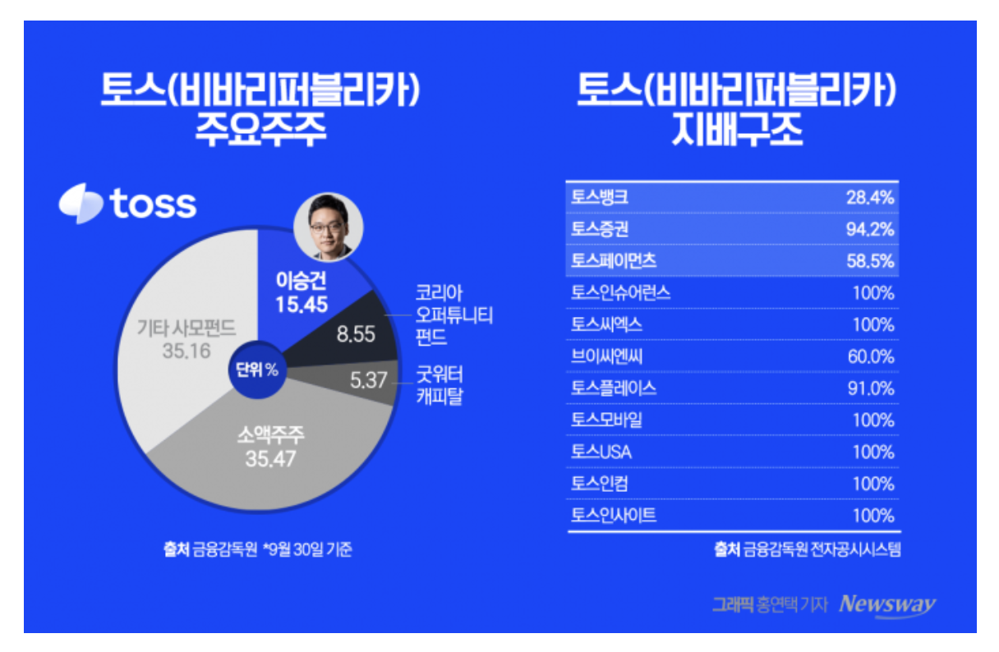

# 토스뱅크

## 1. 어떤 비전을 가지고 있나요?

`출범`: 2021.10.05 (국내 20번째 은행), `핵심`: 새롭고 고객 지향적인 은행을 통한 혁신

- 토스 커뮤니티의 [핵심 가치 3.1](https://toss.oopy.io/a201e419-e243-4401-983f-1ac3cad02900)을 바탕으로 아래 미션과 목표를 지향한다.
- 미션 (존재 이유)
  - 이전으로 돌아갈 수 없는 새로운 은행 경험 제공
- 목표 (달성하고자 하는 모습)
    - 금융 서비스의 중심을 ‘공급자’에서 ‘사용자 중심’으로 이동
    - 고객 범위 확장 -> 직장인, 소상공인, 저신용자
    - 당연하게 여겨졌던 불편함들을 하나씩 개선

## 2. 어떤 방식으로 일을 하나요?

- 핵심 전략
  - `PO`: 가장 단순하지만, 가장 큰 혜택을 주는 제품을 만드는 데 집중한다.
  - `Tech`: 비즈니스에 임팩트를 주는 기술을 도입하고, 대한민국 금융 IT 수준을 상향 평준화한다.
- 일하는 과정
  - 금융 서비스의 접근성과 포용성을 넓히는 데 집중한다.
  - 빠른 실행과 주기적인 회고를 통해 혁신을 추구하되, 은행으로서의 `안정성`과 `정합성`을 놓치지 않는다.
- 조직 문화
  - `신뢰와 자율`: 누구나 문제 해결의 주체가 되는 신뢰 기반의 문화 속에서 일한다.
  - `DRI` (최종 의사결정권자): 적극적인 의지를 가진 사람이 자신만의 권한과 책임을 가지고 일한다.
  - `본질과 몰입`: 불필요한 절차 대신 일의 본질에 집중하여 제품에 큰 임팩트를 만든다.

## 3. 어떤 서비스를 운영하고 있나요?

### 통장

### 예적금/목돈 굴리기

### 대출/갈아타기

### 신용카드/체크카드/서비스

## 4. 각 서비스의 조직도를 직접 예측해 보세요.

### 전체

> 2025.03.20 기준

- 여러 직무가 모인 곳 - 스쿼드
- 같은 직무가 모인 곳 - 챕터

### 세부

> 아래는 [토스뱅크 채용 공고](https://toss.im/career/community/tossbank)를 바탕으로 [Server Developer](https://toss.im/career/job-detail?job_id=4071141003&sub_position_id=4076109003&company=토스뱅크) 중심으로 작성했으며, 일부는 생략했습니다. 

- Engineering
  - **Server Developer** (주요 기술 스택: Kotlin, Spring, MySQL, Redis, Kafka, Prometheus, Grafana)
    - Product
      - 각 스쿼드(여신/수신/카드/외환 등)에 소속되어 고객 대상 제품 기능을 전담 개발
      - Java/Kotlin, Spring Boot 기반의 MSA 환경 구축 및 운영
    - Platform 
      - 뱅킹시스템 안정화 책임, 플랫폼 서비스 및 공통 기능 개발 및 운영
      - 플랫폼 서비스(대용량 메시지 발송, API Gateway, APM, Monitoring & Alert System, ELK, HAProxy 등)
      - 서비스에서 사용하는 공통 기능(Metric, Logging, Message Queue, Distributed Lock, Memory Cache 등)
    - Internal Product
      - 운영 효율화를 위한 토스뱅크 고유의 통합 어드민(DIG, Sherlock) 시스템 개발
      - 자금세탁방지(AML), 규제 보고 등 컴플라이언스 업무 자동화 파이프라인 구축
    - 수신플랫폼
      - 수신 상품을 구성하는 다양한 스쿼드(수신, 모임, 외환, 송금 등)와 협업하며 수신 도메인의 플랫폼화 주도
      - 예금 계좌 개설 -> 조회/송금 -> 이자 지급 -> 해지까지 전 과정의 트랜잭션 및 정합성 관리
      - Kotlin, Spring 기반의 MSA 환경으로 재구성 중 -> 실제 성공 사례: '지금 이자 받기', '평생 무료 환전' 서비스
    - 계정계
      - 여/수신, 카드, 외환 등 금융 코어 시스템의 아키텍처 설계 및 운영
      - 기존 모놀리식 코어뱅킹 시스템을 단계적으로 MSA로 전환하는 마이그레이션 주도
      - 대용량 트랜잭션 처리 및 유량 제어 방법론에 익숙하면 좋음
    - 여신 - 대출상품을 구성하는 여러 스쿼드(개인여신, 기업여신, 전세 등)와 협업
      - 대출 금리 - [관련 이야기](https://toss.im/career/article/bank-server-developer-1)
        - 토스뱅크 내 모든 대출 상품(신용, 기업, 전세 등)의 금리를 산출하고 적용하는 시스템을 총괄하며, 신규 상품을 위한 금리 체계를 개발
        - MDD 기반의 레거시 시스템을 Kotlin/Spring 기반으로 전환하며, 복잡한 금리 산출 로직을 구조화하는 작업을 수행
      - 대출 신청/심사 - [관련 이야기](https://toss.im/career/article/bank-server-developer-2)
        - 비대면 환경에서 대출 신청부터 심사까지 전 과정이 자동으로 이루어지도록 프로세스를 설계하고, 신용평가 시스템(CSS)을 개발
        - 모놀리식 심사 시스템을 유연한 MSA 구조로 전환하며, 대규모 트래픽 처리를 위한 아키텍처 개선을 주도
      - 대출 실행/상환 - [관련 이야기](https://toss.im/career/article/serverdeveloper-3)
        - 자금 이체, 회계 처리 등 실질적인 돈의 흐름(실행)과 원리금 상환 일정 관리 및 정산(상환)을 담당하여 정합성을 보장
        - 1원의 오차도 없는 고정밀 수치 계산 로직을 구현하고, 정책 변경에 유연하게 대응할 수 있는 지속 가능한 도메인 설계를 수행
      - 대출 사후 관리 - [관련 이야기](https://toss.im/career/article/bank-server-4)
        - 연체, 추심, 감면, 상각 등 대출 실행 이후 발생할 수 있는 모든 리스크 관리 프로세스를 시스템화하여 자산 건전성을 지킴
        - 복잡한 법적/정책적 요구사항을 시스템 로직으로 녹여내고, 회수 및 채권 상태 관리를 위한 대용량 데이터 처리 파이프라인을 구축
  - Frontend Developer
  - Android / iOS Developer
  - Node.js Developer
  - Site Reliability Engineer
- Data
  - Data Engineering Department Leader
  - Data Engineer 
    - Backend / Platform: Hadoop, Kafka & Streaming, Airflow Ops
    - Finance / CPC
    - Data Reliability
  - Data Analytics Engineer
  - Data Scientist / ML Backend Engineer
  - Data Product Manager (AI)
- Engineering Support
- Security
- Product
- Design
- Finance
- Legal & Compliance
- Strategy
- People

## 기타. 토스 - 토스뱅크 지배구조

- 비바리퍼블리카(토스) 지배구조: 이승건 대표 (15.45%), 기타 투자사 및 소액주주로 구성
- 토스의 자회사 지분율 비교
    - 토스증권: 94.2%
    - 토스페이먼츠: 58.5%
    - **토스뱅크: 28.4% (유독 낮음)**
    

- 왜 토스뱅크만 지분율이 28.4%로 낮을까?
    - 은산분리(은행-산업자본 분리) 규제의 법적 한도
        - 원칙: 비금융 주력자(산업자본)는 은행 지분을 4%까지만 보유 가능.
        - 예외: 인터넷전문은행 특례법(2019년) 적용 시 **최대 34%**까지 보유 가능하지만, 이 또한 상한선이 존재함. (증권, 페이먼츠 등은 이 규제가 없어 50% 이상 보유 가능)
    - 대규모 자본 확충에 따른 지분 희석
        - 은행업 특성상 BIS 비율 유지를 위해 막대한 자본금이 필요.
        - 속적인 외부 투자 유치(유상증자) 과정에서 토스의 지분율이 자연스럽게 하락함.
    - 금융융지주사 강제 전환 방지 (전략적 이유)
        - 자회사 주식 가치 합계가 모기업 총자산의 50%를 초과하면 `금융지주회사`로 강제 전환됨.
        - 지주사 전환 시 부채 비율 등 까다로운 규제를 받게 되므로, 이를 피하기 위해 토스뱅크 지분율을 **30% 미만으로 조절**하여 관리하는 것으로 해석됨.